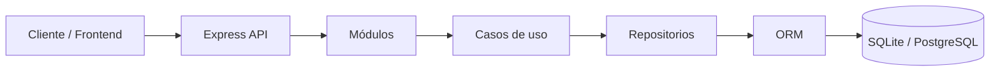
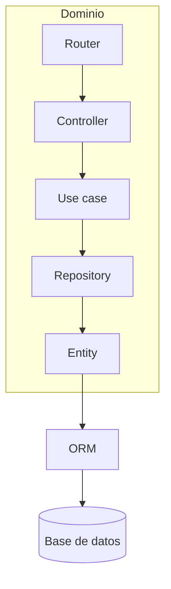
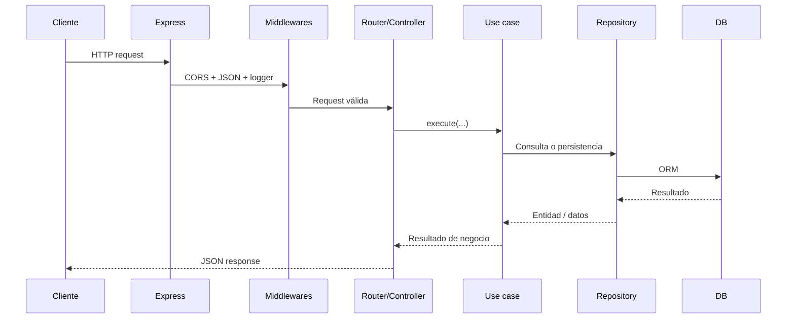
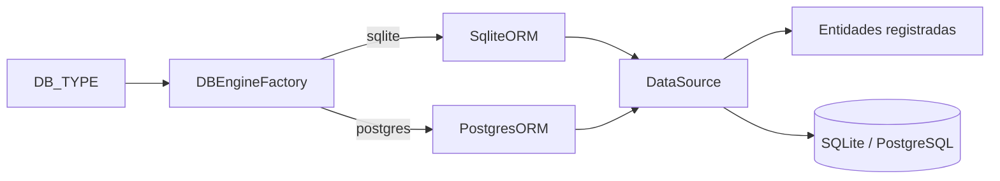
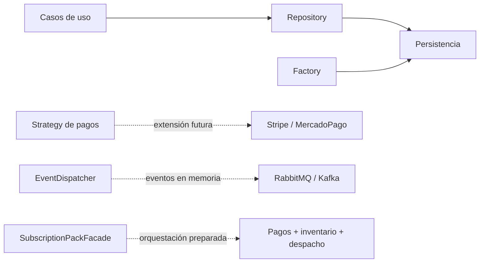
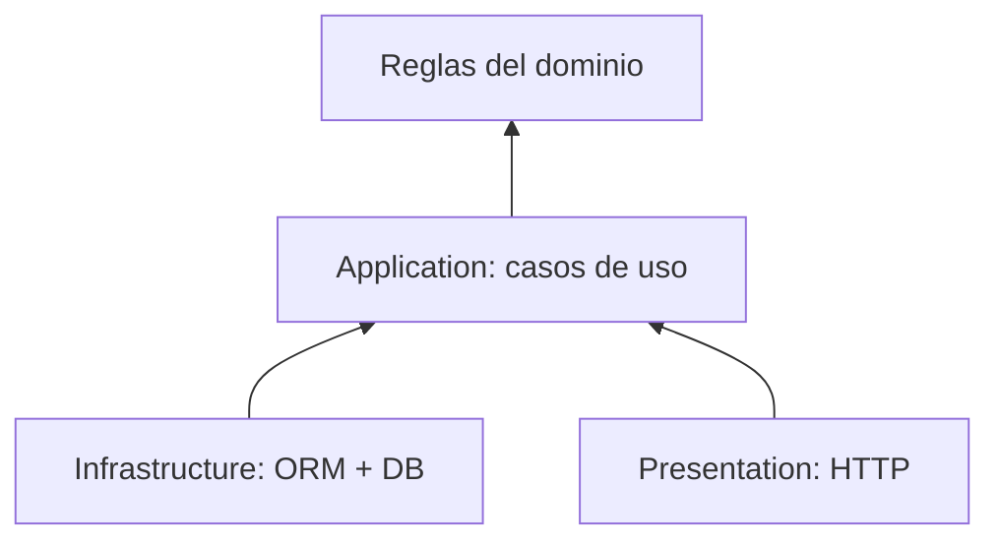

# Decisiones de Arquitectura del Backend

Esta página documenta cómo está construido el backend actual y qué responsabilidad tiene cada pieza. Los diagramas reflejan el código real; cuando un patrón está preparado pero todavía no tiene una integración concreta, se indica explícitamente.

Para el modelo de clases y las operaciones expuestas por cada módulo, ver el [diagrama de clases](diagrama-de-clases.md).

## 1. Composición general: monolito modular

Se eligió un monolito modular porque todas las funcionalidades comparten proceso y persistencia, pero se mantienen separadas por dominio.

La ventaja es poder evolucionar cada módulo sin pagar todavía el costo operativo de varios servicios desplegables.

## 2. Cómo se construye un dominio

Cada feature se organiza como un vertical slice: la entrada HTTP, la lógica de aplicación y la persistencia viven dentro del mismo módulo.

Ejemplo real para `cajas-mensuales`:

- `presentation/`: router y controller.
- `domain/useCase/`: altas, bajas, modificaciones, consultas y recomendación.
- `infrastructure/`: entidad ORM y repository.

El controller no contiene reglas de negocio: traduce la request y delega en un caso de uso. El repository concentra las consultas y el mapeo hacia ORM.

## 3. Ciclo de una request

La aplicación aplica middlewares globales antes de resolver las rutas y centraliza los errores al final del pipeline.

Si una etapa lanza un `AppError` u otra excepción, `errorHandlerMiddleware` transforma el error en una respuesta HTTP consistente.

## 4. Persistencia intercambiable

La base se selecciona mediante `DB_TYPE`, sin modificar los módulos de negocio.

Esta decisión permite usar SQLite para desarrollo local y PostgreSQL para un entorno más cercano a producción. Los repositories dependen del `DataSource`, no de una implementación concreta del motor.

## 5. Patrones que desacoplan decisiones

| Decisión | Responsabilidad | Estado actual |
|---|---|---|
| Repository | Aislar consultas y persistencia | Implementado |
| Factory | Elegir SQLite o PostgreSQL | Implementado |
| Strategy | Permitir proveedores de pago intercambiables | Contrato preparado; sin proveedor integrado |
| Observer / EventDispatcher | Desacoplar eventos de dominio | Dispatcher en memoria |
| Facade | Orquestar suscripción, pago, inventario y despacho | Estructura preparada; flujo pendiente |

## 6. Regla de dependencia

La dirección buscada es que HTTP y ORM sean detalles externos. Las reglas de negocio deben vivir en los casos de uso y no depender de `Request`, `Response` ni de consultas SQL directas.
