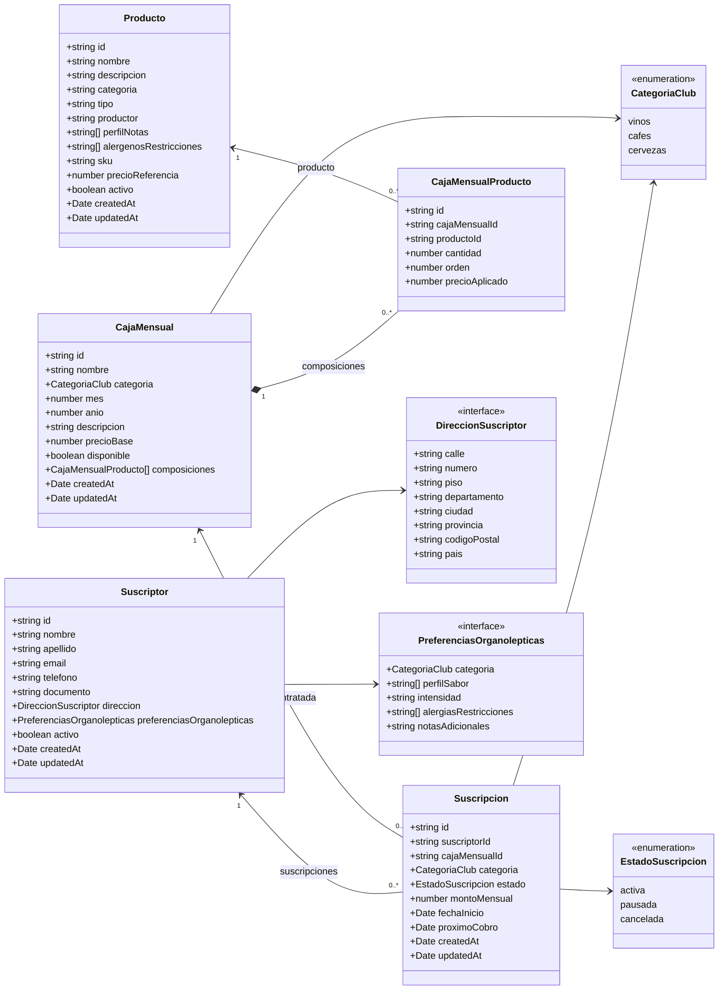
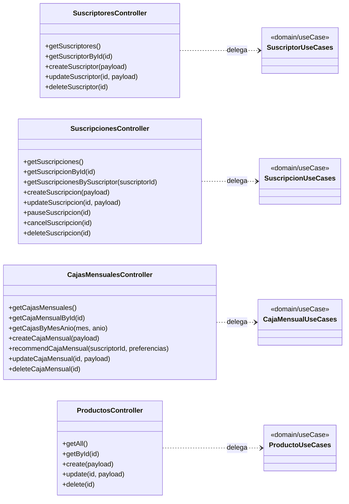

# Diagrama de Clases del Backend

Este diagrama combina el modelo de entidades definido en `diagrama-entidad-relacion.dbml` con las operaciones que hoy exponen los controllers del backend.

## Modelo de dominio

### Reglas representadas

- Un `Suscriptor` puede tener muchas `Suscripcion`; eliminarlo elimina sus suscripciones (`CASCADE`).
- Una `Suscripcion` referencia una `CajaMensual`, que no puede eliminarse si está siendo utilizada (`RESTRICT`).
- `CajaMensualProducto` es la clase intermedia entre `CajaMensual` y `Producto` y guarda cantidad, orden y precio aplicado.
- Una caja elimina sus composiciones dependientes (`CASCADE`); un producto no puede eliminarse si tiene composiciones (`RESTRICT`).

## Funcionalidades actuales

Los controllers reciben las requests HTTP y delegan cada operación en un caso de uso del mismo módulo.

Los nombres agrupados (`SuscripcionUseCases`, por ejemplo) representan los casos de uso existentes en `domain/useCase/`; no son una clase única implementada en el código.

## Ubicación en el backend

| Elemento | Ubicación |
|---|---|
| Entidades y relaciones | `Backend/src/modules/*/infrastructure/*.entity.ts` |
| Controllers | `Backend/src/modules/*/presentation/controller.ts` |
| Casos de uso | `Backend/src/modules/*/domain/useCase/` |
| Repositories | `Backend/src/modules/*/infrastructure/*-repository.ts` |
