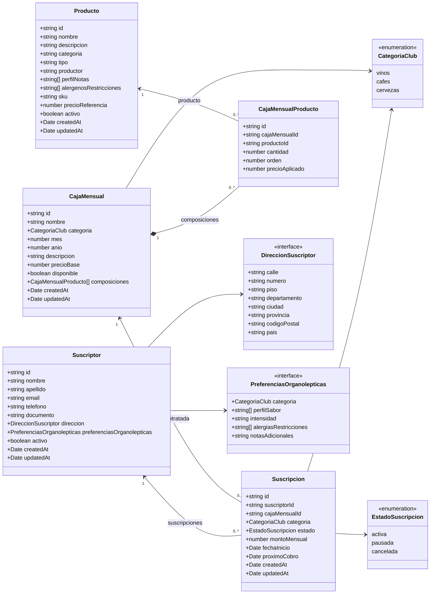
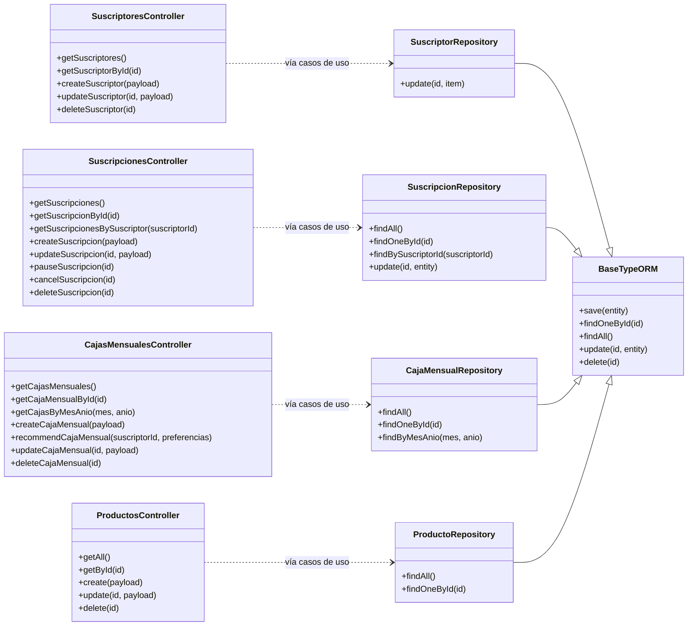

# Diagrama de Clases del Backend

Este diagrama combina el modelo de entidades definido en `diagrama-entidad-relacion.dbml` con las operaciones que hoy exponen los controllers del backend.

## Modelo de dominio

### Reglas representadas

- Un `Suscriptor` puede tener muchas `Suscripcion`; eliminarlo elimina sus suscripciones (`CASCADE`).
- Una `Suscripcion` referencia una `CajaMensual`, que no puede eliminarse si está siendo utilizada (`RESTRICT`).
- `CajaMensualProducto` es la clase intermedia entre `CajaMensual` y `Producto` y guarda cantidad, orden y precio aplicado.
- Una caja elimina sus composiciones dependientes (`CASCADE`); un producto no puede eliminarse si tiene composiciones (`RESTRICT`).

## Funcionalidades actuales

Los controllers representan las operaciones HTTP disponibles y los repositories representan el acceso a persistencia. Los casos de uso existen entre ambas capas, pero se omiten de este gráfico para mantenerlo legible.

Los métodos de los controllers están tomados del código real. La relación punteada indica el flujo simplificado `Controller → casos de uso → Repository`; no implica que el controller instancie directamente el repository. Los métodos comunes de `BaseTypeORM` son heredados por los cuatro repositories.

## Ubicación en el backend

| Elemento | Ubicación |
|---|---|
| Entidades y relaciones | `Backend/src/modules/*/infrastructure/*.entity.ts` |
| Controllers | `Backend/src/modules/*/presentation/controller.ts` |
| Casos de uso | `Backend/src/modules/*/domain/useCase/` |
| Repositories | `Backend/src/modules/*/infrastructure/*-repository.ts` |
| Repository base | `Backend/src/common/classes/base-typeorm-repository.ts` |
